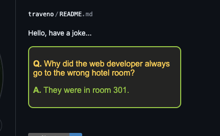

<script>
  import Window from '/src/lib/widgets/Window.svelte';
</script>

I spend a lot of time reading other blogs on the internet. No, not cooking blogs--they have their place--this is
about developer blogs. The kind that shares content related to webdev and software engineering. Reading these journals
is a great way to learn tricks or gain insight about the industry, and I'm also particular about
my application design, so I know they're great sources of inspiration too.

Oh, hopefully I didn't rub any food bloggers the wrong way. Just to be clear, your 
grandmother's recipes are priceless. Truly. My family never knows what to expect from me at gatherings... 

Recently, I thought to myself, *"why not write my own?"* Who knows, maybe I could provide you--the reader--food for thought. Software food, that is.
Now that'd be cool. So let's jump in, I know exactly what libraries I'd like to use to achieve this. 
Once this project is deployed, **I'll write my first entry about developing this very blog!** :grin:

## Goals

Firstly, I'd like to keep it simple. This is just a personal site and the scope is quite small. I need a web application
that collates and renders markdown files (as posts). Also, I will be the only user (no authentication system needed). 
Finally, it should dish out my ramblings in style, because
reading something that is a mess visually does not inspire my confidence! Just sayin'.


[Relative link to / (for testing)](/)

### Architecture

Key libraries we'll use to write this...

* [`SvelteKit`](https://kit.svelte.dev/)
-- my favorite SSR web application framework
* [`Tailwind`](https://tailwindcss.com/) 
-- allows us to quickly style our blog with great taste
* [`MDsveX`](https://mdsvex.pngwn.io/)
-- a markdown file renderer for our posts

This is a pretty sweet combo, and with the ability to render markdown files in our application, we can achieve
great looking posts using just text files! Just like the post you're reading now. No fancy editor needed. Bonus is that everyone is
familiar with how markdown files work, so we're all happy. Check out the following example...

<Window name="my_blog_post.md">

```md
## Architecture

Key libraries we'll use to write this...

* [`SvelteKit`](https://kit.svelte.dev/)
-- my favorite SSR web application framework
* [`Tailwind`](https://tailwindcss.com/)
-- allows us to quickly style our blog with great taste
* [`MDsveX`](https://mdsvex.pngwn.io/)
-- a markdown file renderer for our posts
```

</Window>

Looks familiar right? Effortless and consistent! :clap:

## Getting started

If you're still tuned in, let's get our environment set up. Start by initializing a new SvelteKit project...

<Window name="Terminal">

```bash
npm create vite@latest cool-dev-blog -- --template svelte-ts
cd cool-dev-blog
npm i
```

</Window>

<Window name="src/routes/api/posts/+server.ts">

```ts
export const GET = async () => {
  // Check for posts
  const query = import.meta.glob('/src/posts/*.md', { eager: true });
  // Fetch posts and format it for our client
  const posts: Post[] = Object.entries(query).map(([path, post]) => {
    const { metadata } = <{ metadata: any }> post;
    const slug = path.split('/').at(-1)?.replace('.md', '');
    return { ...metadata, slug } as Post
  }).sort((a, b) => new Date(b.date) - new Date(a.date))
    .filter(p => p.published);
  // Send data to client
  return json(posts);
}
```

</Window>

There's a lot going on here, so let's break down what's happening...

## Client side query

The client needs to know which posts are available to read. We can achieve this by having an API endpoint on the server.
The following block of code is accessible by sending a GET request to ` /api/posts `

Etc, etc. The remaining text is a style test using Lorem Ipsum.

Integer nec ultricies nisi. Curabitur odio mauris, scelerisque at luctus a, bibendum eget velit. Vivamus id tellus lectus. Nulla in purus sit amet mi tincidunt commodo. Ut auctor ante a mauris dignissim laoreet. Nullam magna arcu, tincidunt nec risus et, mattis fringilla augue. Suspendisse imperdiet, purus vel pharetra bibendum, enim purus convallis quam, ut faucibus nibh libero in enim. Curabitur feugiat leo ac accumsan tempor. Ut non convallis mauris, sed rutrum libero.

## Here's a list!

1. First item
2. Second item
3. Third item

Lorem ipsum dolor sit amet, consectetur adipiscing elit. Maecenas vestibulum odio nisl, nec pretium dolor varius in. Quisque tincidunt egestas libero rhoncus blandit. Etiam elit leo, facilisis id magna sit amet, vestibulum finibus nulla. Vestibulum porttitor nisl id ligula accumsan, et dapibus justo cursus. Phasellus congue mauris vitae dictum auctor. Sed vitae mollis quam. Morbi venenatis metus ligula, sit amet consectetur eros pharetra vel.

## Markdown

Hey friends! 👋

```ts
function greet(name: string) {
	console.log(`Hey ${name}! 👋`)
}
```

Integer nec ultricies nisi. Curabitur odio mauris, scelerisque at luctus a, bibendum eget velit. Vivamus id tellus lectus. Nulla in purus sit amet mi tincidunt commodo. Ut auctor ante a mauris dignissim laoreet. Nullam magna arcu, tincidunt nec risus et, mattis fringilla augue. Suspendisse imperdiet, purus vel pharetra bibendum, enim purus convallis quam, ut faucibus nibh libero in enim. Curabitur feugiat leo ac accumsan tempor. Ut non convallis mauris, sed rutrum libero.